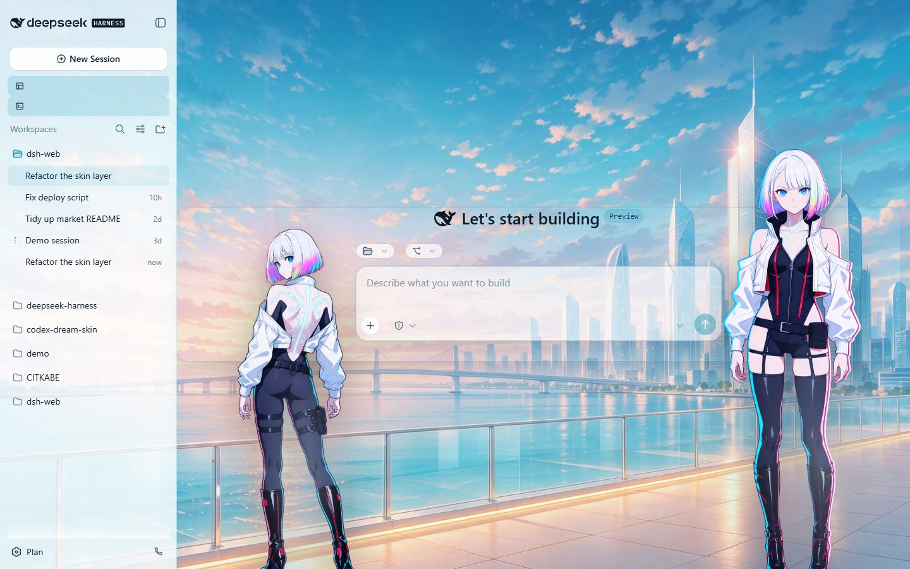
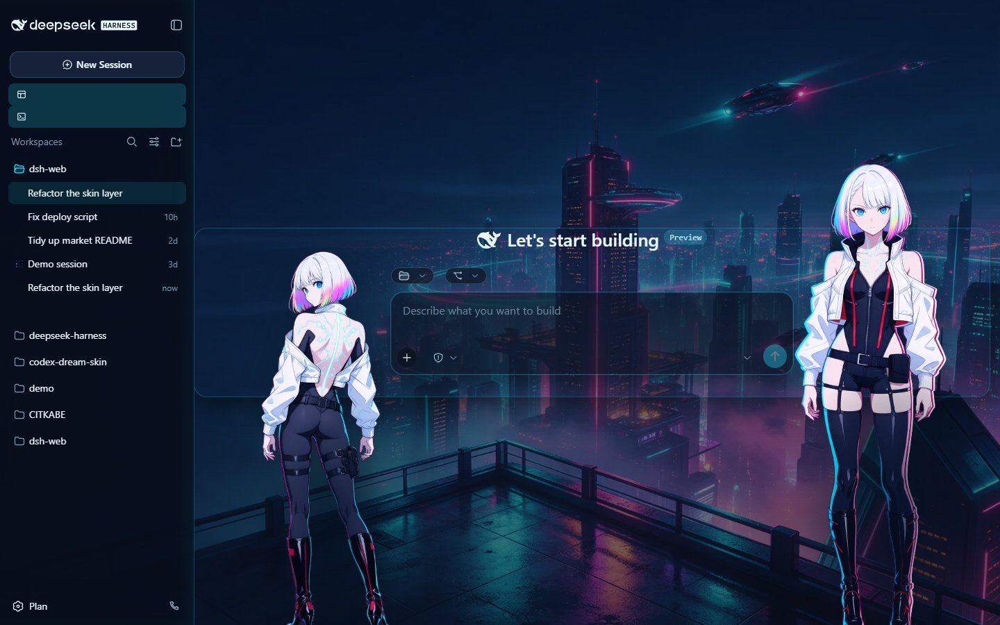

# 露西·夜城信号

[English](README.md) | 中文

dsh web GUI 的赛博朋克皮肤，纯资产目录：黄昏与霓虹两张天台场景，两个抠好透明底的立绘分别贴着输入框的左沿与右沿，并随左右抽屉自动跟随。无 `package.json`、无构建步骤，皮肤中心是唯一加载器。

| | |
| --- | --- |
| id | `lucy-nightsignal` |
| 版本 | 0.1.0 |
| 清单 | v2 |
| 许可 | CC BY-NC-SA 4.0（非官方同人） |

## 预览

亮色：

暗色：

两张都是 1440x900 JPEG q85，由市场自己那套 facade 渲染器拍摄。

## 是什么

- `skin.json`（v2 清单）+ `skin.css`（L1 token 重映射：亮色 `:root`、暗色 `body[data-ds-dark-theme]`）+ `patches.css`（L3：两层立绘与霓虹描边）。
- 立绘锚在 `[data-composer-card]` 上：左立绘的右沿贴输入框左沿（`left: anchor(... left)` + `translate: -100% 0`），右立绘的左沿贴输入框右沿。输入框在抽屉开合时会重新居中，所以两人跟着走，全程不需要测量。
- 立绘层级是 `z-index: 900`：高于所有官方面板、低于鲸鱼娘挂件（挂在 `<body>` 上、`z-index: 9999`），保证挂件气泡不被压住。
- **没有 `hooks.mjs`**：市场预览渲染器不执行皮肤 hooks，所以场景刻意做成纯声明式。

## 来源与版权

**素材均为 AI 生成。** `assets/` 下的所有位图都由图像模型经 OFOX 图像 API 生成，随后在
本地处理。角色形象是纯文本描述的：**没有**把照片、cosplay 图或其它第三方图片作为模型输入。

**哪个模型生成了什么。** 立绘（`lucy-signal-left.webp`、`lucy-signal-right.webp`）与两张
场景（`scene-light.webp`、`scene-dark.webp`）出自 `volcengine/doubao-seedream-5.0-pro`，
逐次记录见 `docs/ART-PROVENANCE.md`；立绘在本地做色度键抠图（键色估计、alpha 斜坡、解混、
去溢色、alpha 阈值、连通域去噪）。更早还有两次背景尝试用的是
`openai/gpt-image-2.5-sunburst`，它们在上述文档里标注为 **superseded**，
**没有任何出货文件来自那两次**。

**角色与所属作品。** 立绘描绘的是**《赛博朋克：边缘行者》**（Cyberpunk: Edgerunners）中的
**Lucy / Lucyna Kushinada**。角色设计、作品本身与世界观的权利归其权利人：
**Studio TRIGGER** 与 **CD PROJEKT RED**（及其各自的许可方与权利继承人）。

**使用条款。** **仅供个人非商业使用。** 本作品为**非官方同人作品**：与
Studio TRIGGER、CD PROJEKT RED、本仓库维护者以及 DeepSeek Harness 项目**均无关联**，
未获其授权、赞助或背书；角色与作品的一切权利归原权利人。若权利人提出异议，应移除本皮肤。

**贡献者责任。** 本皮肤的贡献者承担其版权与合规责任，并保证有权按此处声明的范围
分发其中的每一个文件：图像由上述模型生成，文字与代码为贡献者本人所作，随包字体按字体
自身的许可再分发。若其中任何部分被认定侵权，贡献者将按要求更正或移除。

**皮肤自身的许可。** 皮肤自己的文件（`skin.json`、`skin.css`、`patches.css`，
以及存在时的 `hooks.mjs`）按 **CC BY-NC-SA 4.0** 发布 —— 见本目录下的 `LICENSE`
与 `skin.json` 的 `licenseUrl`。仓库根目录的 `LICENSE` 是 BSD-3-Clause，覆盖仓库自身
代码，不覆盖本皮肤。两个许可都不授予角色或原作品的任何权利。

## 已知限制

- 纯呈现层：只改浏览器样式，不触及模型请求。
- 锚点定位需要 Chrome 125+；更老的引擎由普通回退值兜底。
- `patches.css` 有几处匹配 CSS-Modules 哈希类名，官方重建后可能改名（`dsh-skin validate` 会按设计给出 warning）。

完整的做法推导（含实测踩坑）见项目仓库的 `docs/SKIN-TECHNIQUE.md`。
