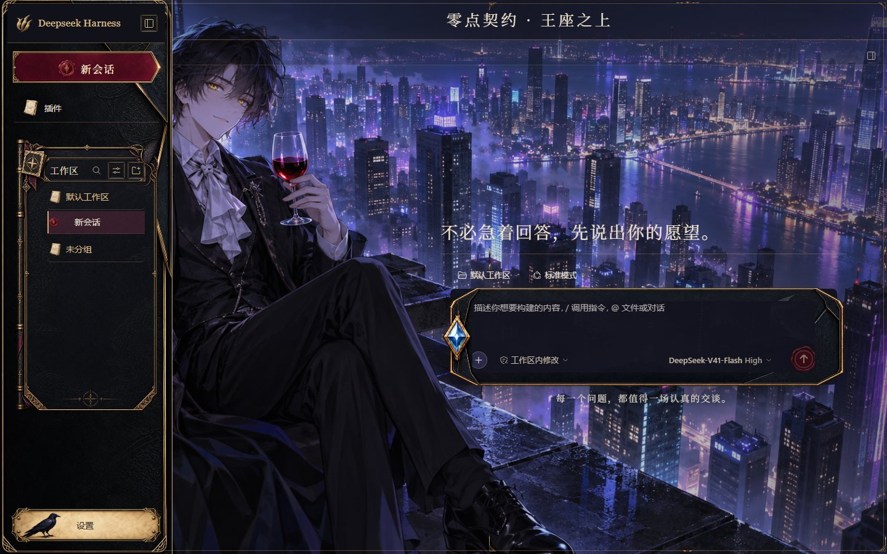

# Midnight Contract · Night City

English | [中文](README.zh.md)

A Lu Mingze / Dragon Raja inspired skin for the real DeepSeek Harness Web GUI. Night City uses the contributor-selected background unchanged, with a compact Deepseek Harness wordmark and custom generated contract materials throughout the interface. Its companion [skin](../midnight-contract/README.md) shares the component language with a different scene.

## Preview

These are actual DSH 0.1.7-rc.1 GUI captures, not generated mockups. The default model label belongs to the host; no model call or synthetic assistant reply was used.

| Light | Dark |
| --- | --- |
|  |  |

Additional real captures are in [preview/](preview/). [Verification](VERIFICATION.md) records the tested states and limits.

## Interface

- Dragon-leather sidebar, compact Deepseek Harness brand row and burgundy invitation plaque. The portrait section was removed at the contributor's request.
- Generated workspace folio, metal spine, feather corner and custom folder/session glyphs; native scrolling and workspace actions stay intact.
- Sapphire envelope composer and red wax send seal; attachment, permission and model controls remain native interactive controls.
- Generated dossier frames for menus, model cards and message/tool surfaces; dark engraved input beds, action plaques and sapphire toggle thumbs.
- Ivory settings surfaces in light mode and navy surfaces in dark mode. Both retain the dark contract sidebar and contract composer.
- Desktop hero copy stays to the right of the supplied left-hand character. Collapsed rails and narrow dialogs adapt to their real layout; settings navigation becomes horizontal below 600px.

## Install and remove

Copy this entire directory to the skin center's user skin directory, normally `$DSH_HOME/skins/midnight-contract-city/`, then open the real DSH GUI and select it in Settings. `DSH_SKINS_HOME` overrides the user skin directory when explicitly configured.

This folder is an asset package, not a standalone HTML app. It needs the DSH web host and skin-center v2 loader. Choose another skin or no skin to restore host styling. The background controller retains Wallpaper Engine > manual background > skin background priority; the skin does not override user wallpaper settings.

## Integration and scope

Both files are controller-scoped to `html[data-dsh-skin="midnight-contract-city"]`. `skin.css` defines L1 tokens and L2 semantic parts; `patches.css` is a disclosed L3 layer for the real sidebar, composer, settings navigation, provider editor, switch thumb and menu suffixes. It uses stable semantic attributes/class suffixes rather than build hashes or text-dependent selectors.

The skin has no executable hook, remote asset, model behavior change, credential handling or backend configuration. Optional skill, task and SSH rows are decorated only when their actual plugins are installed; the skin does not invent navigation entries. Skin materials never carry functional text. Do not apply backdrop-filter to the composer: the controller owns its separate frost layer and fixed-tooltip positioning.

## Assets and license

This is an unofficial fan skin depicting Lu Mingze (路鸣泽) from Dragon Raja (《龙族》), originally written by Jiang Nan (江南, Yang Zhi / 杨治). The original novel and character rights belong to Jiang Nan and the respective original rights holders; all rights in the work, character and any applicable licensed adaptations remain with their respective rights holders. The artwork and this character-themed skin are for personal, non-commercial use only. They are not affiliated with, endorsed by or officially produced by the dsh-skins repository, its maintainers, Deepseek Harness, or the Dragon Raja rights holders. Inclusion or hosting does not imply affiliation. If a rights holder objects, the contributor will promptly remove the affected artwork and cooperate with repository takedown. AI generation and a contributor declaration do not constitute permission from the franchise rights holders.

The Apache-2.0 LICENSE applies to independently authored CSS and code only. Backgrounds, generated UI images and previews containing that artwork are governed by the personal non-commercial artwork notice here, not an Apache-2.0 commercial-use grant. No franchise, character or third-party rights are granted. The manifest artwork license is LicenseRef-Personal-NonCommercial-Fan-Art and points to this NOTICE.

Background creation category: AI-generated fan artwork created by the contributor using Codex image generation, confirmed on 2026-10-03. UI images were generated through OpenAI image_gen. See [source declaration](SOURCE-DECLARATION.md), [NOTICE](NOTICE.md), [asset provenance](asset-provenance.json) and [generation prompts](generation-prompts.json) for file identities, evidence and limits. Older Steam Workshop artwork is excluded.

[Dragon Raja novel official account](https://www.weibo.com/cassellcollege?tabtype=newVideo), [Jiang Nan author interview](https://www.chinawriter.com.cn/n1/2018/0523/c405057-30006739.html). These links identify the original work and author; they are not image sources or a license.

## Development

This directory was originally generated in dsh-skins with `node scripts/dsh-skin-new.cjs midnight-contract-city`. The independent [distribution repository](https://github.com/Theater-ahyeon/midnight-contract-skins) runs:

```sh
pnpm typecheck
pnpm test
pnpm docs:check
pnpm check
```

Here `typecheck` is JavaScript syntax checking, not TypeScript type analysis. These commands verify package resources and documentation; actual-host evidence is separate in VERIFICATION.md. The upstream contribution also runs the official catalog/CSS-safety, hooks, build and typecheck gates. The skin itself has no local build step. Recheck class-suffix seams and real screenshots after host upgrades. The [Workshop contribution](https://github.com/zhu1090093659/dsh-skins/pull/35) remains subject to upstream review; this independent distribution does not imply market availability.

## Actual conversation rendering

These are official-host captures with clearly labeled local protocol-fixture content. Messages pass through the real Agent and readonly tool. No external inference or injected DOM response is involved.

| Tool receipt | Code surface |
| --- | --- |
|  |  |
